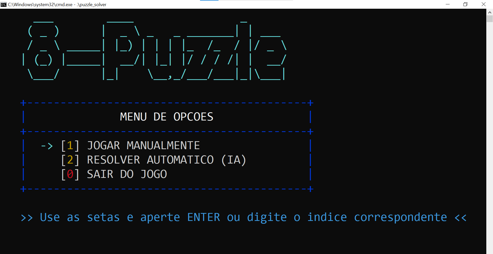
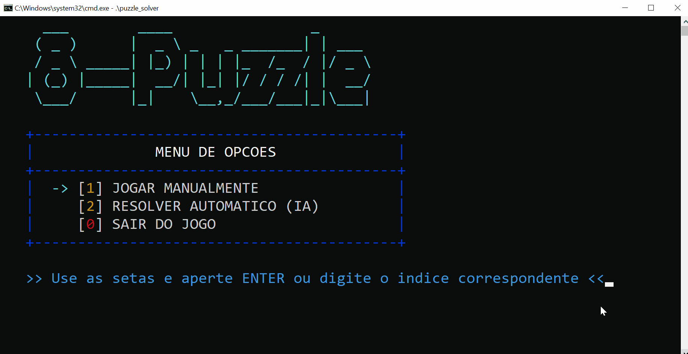

# 🧩 8-Puzzle Solver: Classic Artificial Intelligence in C


This project is a high-performance simulator and solver for the **8-puzzle** game. Developed entirely in C, the software uses **classic AI algorithms (Blind Search)** to explore state spaces and find optimal move sequences for scrambled boards.

This work is part of the **Data Science and Artificial Intelligence** curriculum at **PUC-Campinas (2025)**.

---

## 🎮 User Interface

Below is the interactive interface developed in C, with ANSI color support and keyboard navigation:



---

## 🚀 Key Features

* **Complete AI Logic:** Implementation of fundamental algorithms for search problem resolution.
* **Player Mode:** Terminal-based interface for manual solving, allowing you to test the board's difficulty.
* **Solver Mode (AI):**
    * **Breadth-First Search (BFS):** Guarantees the shortest path to the solution (optimality).
    * **Iterative Deepening Depth-First Search (IDDFS):** Memory efficiency with completeness, ideal for deeper states.
* **Performance Dashboard:** Upon completing a search, the program displays the exact execution time and the number of nodes (states) visited.
* **Step-by-Step Visualization:** Animated "Replay" system that plays back the solution found by the AI on the user's screen.

---

### 🧠 Artificial Intelligence in Action

The solver uses state space search to find the optimal solution. During the search, the system displays real-time performance metrics:



---

## 🧠 Technical Concepts and Engineering

The project was built focusing on low-level performance and strict memory control:

* **State Management:** Each board configuration is treated as a node in a graph, where the edges are the possible moves (Up, Down, Left, Right).
* **Manual Data Structures:** To avoid external dependencies and ensure efficiency, the following were implemented manually:
    * **Dynamic Queues (FIFO):** Support for the BFS search frontier.
    * **Dynamic Stacks (LIFO):** Support for IDDFS and solution path reconstruction.
* **Solvability Guarantee:** The system uses **Inversion Parity** calculations to ensure that every generated board is mathematically solvable, preventing infinite loops.

---

## 🛠️ Code Structure

The architecture is modularized in the `src/` folder:

| File | Description |
| :--- | :--- |
| `main.c` | Entry point, menu interface, and main loop. |
| `buscas.c / .h` | The "brain" of the project; contains the BFS and IDDFS logic. |
| `FuncoesGerais.c / .h` | Board logic, parity checking, and system utilities. |
| `FILA.h / PILHA.h` | Generic implementations of dynamic data structures. |
| `TIPO.h` | Definition of the `Estado` structure, essential for move history. |

---

## 💻 How to Compile and Run

Make sure you have **GCC** (or any C99+ compiler) installed.

1.  **Clone the repository:**
    ```bash
    git clone https://github.com/italobotelho/8-puzzle-solver-ai.git
    ```

2.  **Compilation (Universal):**
    ```bash
    gcc *.c -o puzzle_solver
    ```

3.  **Execution:**
    * **Windows:** `.\puzzle_solver.exe`
    * **Linux/macOS:** `./puzzle_solver`

---

## 📊 Results and Performance

In conducted tests, the **BFS** algorithm found 15-step solutions in less than 1 second, exploring thousands of nodes per second. For problems requiring more than 20 steps, **IDDFS** demonstrated greater memory stability, avoiding Heap overflow.

> **Note:** The complexity of the 8-puzzle is $9!/2 = 181,440$ possible states. This software can navigate this space efficiently.

---

## 🎓 Author and Credits

Developed by **Ítalo Botelho** and colleagues as an academic project at **PUC-Campinas**.
Focused on the intersection of low-level algorithms and Artificial Intelligence.
